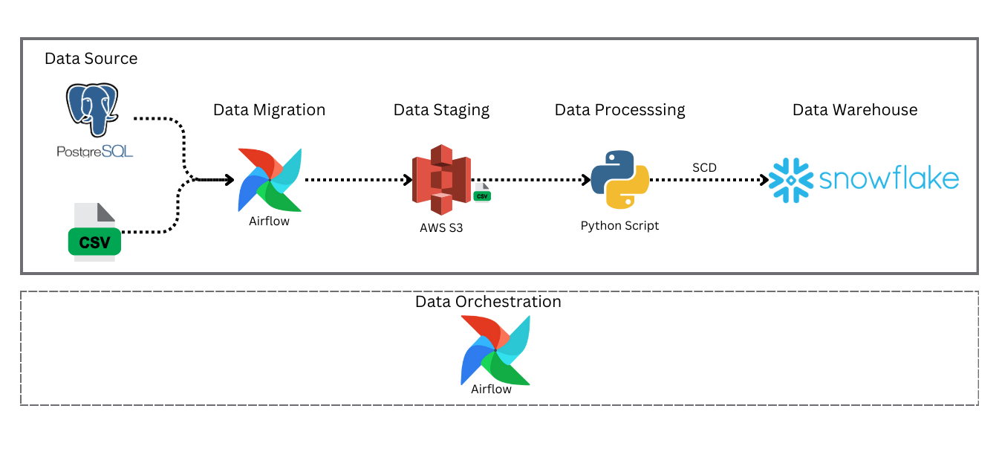
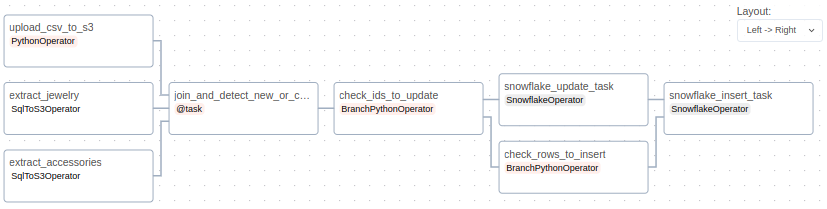

# airflow-ETL-pipeline

## Project Overview:

An ETL Data Pipelines Project that uses AirFlow DAGs to extract accessories and jewelry data from PostgreSQL Schemas and the shoes data from a CSV file, load them in AWS Data Lake, transform them with Python script, and finally load them into SnowFlake Data warehouse using SCD type 2.

## Project Details:

The concept behind this project revolves around leveraging AirFlow DAGs to extract relevant data from PostgreSQL schemas and CSV file, specifically focusing on accessories, jewelry, and shoes data. Subsequently, this data is loaded into an AWS Data Lake, where Python scripts are employed to transform and process the information. Finally, the transformed data undergoes insertion and update operations, facilitating the implementation of the Slowly Changing Dimension (SCD) concept. The primary objective is to maintain a comprehensive historical record of changes in the Snowflake Data Warehouse.

The concept behind this project revolves around leveraging AirFlow DAGs to extract relevant data from PostgreSQL schemas, specifically focusing on accessories and jewelry data. Subsequently, this data is loaded into an AWS Data Lake, where Python scripts are employed to transform and process the information. Finally, the transformed data undergoes insertion and update operations, facilitating the implementation of the Slowly Changing Dimension (SCD) concept. The primary objective is to maintain a comprehensive historical record of changes in the Snowflake Data Warehouse.

## Project Workflow:

1. **AirFlow DAG Implementation:**
   - Design an AirFlow DAG configured to run on an hourly basis, utilizing the TaskFlow approach for seamless data flow between tasks.

2. **Data Extraction Tasks:**
   - Implement two tasks leveraging the `SqlToS3Operator` operation. One task focuses on extracting accessories data, while the other extracts jewelry data. Additionally, utilize the `PythonOperator` which focuses on extracting shoes data and finally loading them into AWS S3

3. **Data Transformation Tasks:**
   - Introduce two tasks responsible for executing Python functions on the extracted data. These functions specifically identify new records' IDs for subsequent insertion into the Data Warehouse. Additionally, they determine the IDs of records containing changes in attributes, facilitating updates and the insertion of new records with updated values. This approach aligns with the principles of Slowly Changing Dimension (SCD) type 2, ensuring a comprehensive historical record of changes.

   - **Aggregate Data into a Single DataFrame:**
     - Combine the transformed accessories, jewelry, and shoes data into a unified DataFrame.

   - **Apply SCD Logic:**
     - Implement Python functions to apply Slowly Changing Dimension (SCD) logic on the combined DataFrame, ensuring proper handling of historical changes.

4. **Data Loading into Snowflake:**
   - Develop a task to load the transformed accessories, jewelry, and shoes data into the respective tables within the Snowflake Data Warehouse.

5. **Error Prevention with BranchPythonOperator:**
   - Integrate Python functions within the Airflow DAG, leveraging the `BranchPythonOperator` operation. These functions assess whether there are new records to insert or records requiring updates before initiating the associated tasks. This proactive approach mitigates potential errors, ensuring a smooth execution of the ETL process tailored to your accessories, jewelry, and shoes data.

# Tools and Technologies:

- [Apache Airflow](https://airflow.apache.org/): Open-source platform to programmatically author, schedule, and monitor workflows.
- [Python](https://www.python.org/): Programming language used for scripting and implementing ETL logic.
- [Pandas](https://pandas.pydata.org/): Data manipulation and analysis library in Python, utilized for DataFrame operations.
- [PostgreSQL](https://www.postgresql.org/): Open-source relational database management system for data extraction.
- [Snowflake](https://www.snowflake.com/): Cloud-based data warehousing platform for efficient storage and retrieval.
- [AWS S3](https://aws.amazon.com/s3/): Scalable object storage service in Amazon Web Services, used for data staging and storage.
- [ETL](https://en.wikipedia.org/wiki/Extract,_transform,_load): Extract, Transform, Load process for data integration and transformation.
- [Data Warehouse Concepts](https://en.wikipedia.org/wiki/Data_warehouse): Principles and architecture of data warehousing for efficient data management.
- [Slowly Changing Dimension (SCD)](https://en.wikipedia.org/wiki/Slowly_changing_dimension): Techniques for handling historical changes in a data warehouse context.

## Airflow DAG:

